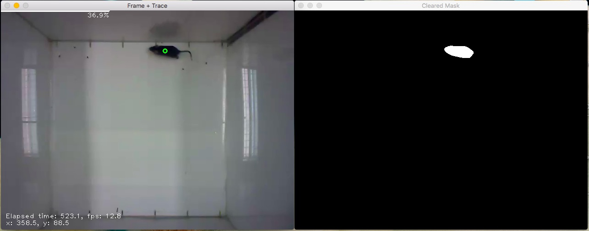

## Behavioral tracing script written in python 
Transferred my tracing code from Matlab to Python. 
This Python code utilizes various libraries, check dependencies first!

### Mouse tracer
#### Latest version: `mouse_tracker3_multiple.py`
This script processes one or multiple videos (.mov,...). Output: .csv file with tracing information and .png screenshot of the trace in the same folder as input video. See `/example` folder for test movie and output.

Example usage: 
```
mouse_tracker3_multiple.py -s 10 -v 'example/olf5_1.mov'
``` 
*`-s`: How many frames should be skipped
*`-v`: Video file to be processed; comma separated list possible

**Dependencies:** 
* OpenCV 3.0 
* Numpy
* Scipy
* imutils
* TQDM 



### Post Process Trace
#### Latest version: `2D_histogram_multiple_3D.py`
This script processes the output .csv files of the tracing script (see above).

**Dependencies:** 
* Numpy
* Scipy
* imutils
* Matplotlib


